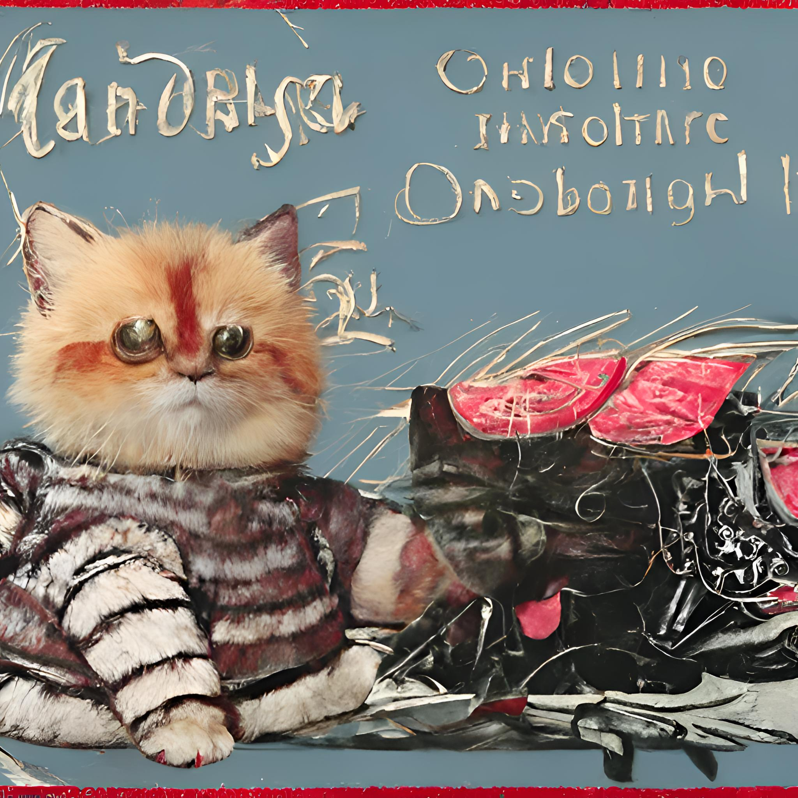

### ¡Hola queridas!

👋🏼 Je m'apelle Matvey 👋🏼

+ Dolgoprudniy, Russia
+ 4th year bachelor, MIPT (Moscow Institute of Physics and Technolog)
+ [@matmuh](https://t.me/matmuh)

🌱 Fascinated by modelling environment with math and code.

🏇🏼 Keen on graphics (Unity, OpenGL, Vulkan).

🐧 Ma projects with brief desription can be found in [CV](cv.pdf).

<!--
**matmuher/matmuher** is a ✨ _special_ ✨ repository because its `README.md` (this file) appears on your GitHub profile.

Here are some ideas to get you started:

- 🔭 I’m currently working on ...
- 🌱 I’m currently learning ...
- 👯 I’m looking to collaborate on ...
- 🤔 I’m looking for help with ...
- 💬 Ask me about ...
- 📫 How to reach me: ...
- 😄 Pronouns: ...
- ⚡ Fun fact: ...
-->
